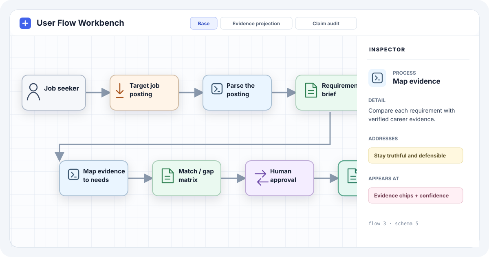

# User Flow Workbench

This repository contains a SolidStart SPA for schema-first product and user-flow maps.

The app combines a graph editor, a canvas, an inspector, and layout logic. The initial example maps a truthful resume-tailoring flow. The tool is general. The resume flow is sample data, not the product boundary.



## Start the app

Use Node.js 22 and pnpm 11. Then run:

```sh
pnpm install
pnpm dev
```

Vinxi prints the local URL. It usually uses <http://localhost:3000>.

Run the production checks with:

```sh
pnpm typecheck
pnpm check:flows
pnpm build
```

Use the Flow CLI to check or canonically format any `.flow` file or directory:

```sh
pnpm flow check path/to/flow.flow
pnpm flow format path/to/flows
pnpm flow format --check path/to/flow.flow
```

Build and serve the workbench for every `.flow` file below the current directory:

```sh
pnpm build
pnpm flow view
pnpm flow view path/to/project --port 4317
```

Open the printed local URL. The index lists nested flow files and reports syntax errors.

Render a diagram with the packaged viewer and a local Chrome or Chromium browser:

```sh
pnpm build
pnpm flow render path/to/flow.flow --output tmp/flow.png
pnpm flow render path/to/flows --output-dir tmp/flow-previews --contact-sheet
```

Rendering uses a fresh browser profile and never writes to `.flow` files or browser storage. The default canvas is 1200 × 800 CSS pixels. The supported minimum is 320 × 240 CSS pixels. The legend is hidden below 480 pixels so compact captures keep diagram content visible. Use `--width`, `--height`, `--scale`, and `--variant <id>` to change the capture. For a directory render, `--scale` also increases contact-sheet tile pixels because each tile follows its source PNG size. Existing output files are preserved unless `--overwrite` is set. The renderer does not download a browser; pass `--browser /path/to/chrome` or set `FLOW_WORKBENCH_BROWSER` when Chrome is outside the standard local paths.

Directory renders preserve each source path below the output directory. They write `report.json` with one result for every source file and return a nonzero code if any file fails. `--report <path>` changes the report location. `--json` prints the result as JSON. `--contact-sheet` writes a PNG contact sheet by default with each successful preview retained at its native pixel size; pass a `.svg` path to keep an SVG sheet instead. Large directories split into `-01`, `-02`, and later pages. Existing sheets are preserved unless `--overwrite` is set.

The workbench reads source files from disk. Browser edits remain in local storage and do not change source files.

Install the published CLI globally or run it without installation:

```sh
pnpm add --global user-flow-workbench
flow check path/to/flow.flow
flow view path/to/project

pnpm dlx user-flow-workbench check path/to/flow.flow
pnpm dlx user-flow-workbench view path/to/project
```

## Install the diagram skill

The repository publishes its diagram-authoring skill from `skills/author-flow-diagrams`.
Install it into another agent environment with:

```sh
npx skills add byronwall/user-flow-workbench --skill author-flow-diagrams
```

## Current capabilities

- Write one node per line in a compact flow DSL.
- Give every edge a stable ID with `edge id from -> to`.
- Convert Flow DSL 3 to schema version 5 JSON for rendering and export.
- Keep needs and UX in the semantic model without placing them on the flow canvas.
- Derive outcomes from terminal deliverables.
- Define ordered structural variants and render them as tabs.
- Replace the base graph with `clear all` inside a variant.
- Keep semantic nodes and edges separate from optional layout state.
- Save exact positions as optional `position id x,y` DSL lines.
- Request automatic placement when positions do not exist.
- Wrap long stage sequences into rows that fit the current canvas.
- Drag nodes and pan or zoom the canvas.
- Show title-only nodes and full details in the inspector.
- Add, duplicate, delete, and edit nodes.
- Export the graph as JSON.
- Persist changes in `localStorage`.
- Use ELK Layered for automatic placement and orthogonal routes.
- Fall back to a local Manhattan router when ELK is unavailable.
- Expose a small `window.flow` API for agents and scripts.
- Discover nested `.flow` files through the local `flow view` server.
- Keep browser edits separate for each source path and workspace.

## Project direction

The tool should make complex flows easy to read and easy to revise. The canvas shows the operational path. The inspector shows the needs and UX attached to that path.

Variants are views of the same starting graph. Each variant stores ordered changes. The app materializes each result and renders it in a tab.

See [docs/product-context.md](docs/product-context.md) for the original intent, decisions, and open questions. See [docs/iteration-history.md](docs/iteration-history.md) for the prototype history.

## Architecture

- `src/routes/index.tsx` lists discovered files and loads the selected flow.
- `src/routes/api/flows.ts` serves the file catalog.
- `src/routes/api/graph.ts` safely loads one catalog document as JSON.
- `src/server/flow-catalog.ts` owns discovery, path checks, parsing, and workspace identities.
- `src/components/` contains the page shell, toolbar, DSL panel, canvas, and inspector.
- `src/lib/graph-dsl.ts` parses and writes the agent-facing flow DSL.
- `src/lib/flow-workbench.ts` contains direct manipulation, routing, layout, and the agent API.
- `src/data/flows/*.flow` contains production flow documents.
- `src/styles.css` contains the visual system from the prototype.

ELK is installed as a package and loads as a separate browser bundle. The local Manhattan router remains the fallback. The browser keeps the editable working graph in `localStorage`.

The API parses selected `.flow` files directly. It does not maintain parallel JSON fixtures.

## Flow DSL

See the normative [Flow DSL specification](docs/flow-dsl-spec.md). A complete example is in [checkout.flow](docs/examples/checkout.flow).

Draft 0.4 uses `flow 3`, typed edge relations, required edge IDs, variant blocks, quoted strings, structural tags, and canonical formatting.

The shortest useful graph has two node lines and one edge line:

```text
flow 3

graph signup "New user signup"
node visitor actor "Visitor"
node account deliverable "Account"
edge signup-completes visitor -> account label="signs up" emphasis=true

variant assisted "Assisted signup" {
  set node account title="Account created with support"
}
```

Node options stay on the same line:

```text
node details input "Signup details" body="The account information supplied by the visitor." tags=["signup","required"] layout=1,0
node form process "Complete form" body="Validate the supplied account details." tags=["signup"] layout=2,0
```

Edges default to operational flow. Typed semantic relations stay in the inspector:

```text
node trust need "Know the account is valid"
node guidance ux "Explain validation errors"
edge form-addresses-trust form -> trust relation=addresses
edge guidance-at-form guidance -> form relation=appears-at
edge guidance-supports-trust guidance -> trust relation=supports
```

The `layout` option is a hint. Omit it to derive a column from the node type and a stable row. Exact positions are also optional:

```text
# Optional manual positions. Delete these lines to use automatic layout.
position visitor 88,72
position account 1152,72
```

Use **Add positions** after moving nodes to write all current coordinates back to the DSL. JSON export puts hints and positions in the top-level `layout` object. Nodes stay semantic and do not own canvas state.

The preserved single-file prototype is in `docs/prototype/index.html`.

## Source

The prototype came from the ChatGPT conversation [Build Flow Diagram Prototype](https://chatgpt.com/c/6a90df99-1ab0-83ea-883d-9b9c04b69241). The local documentation preserves the important context so future work does not depend on that conversation.
